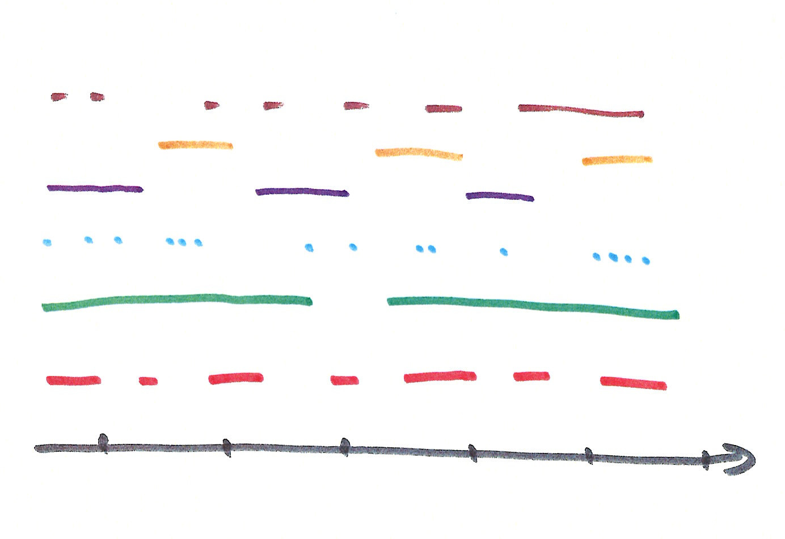
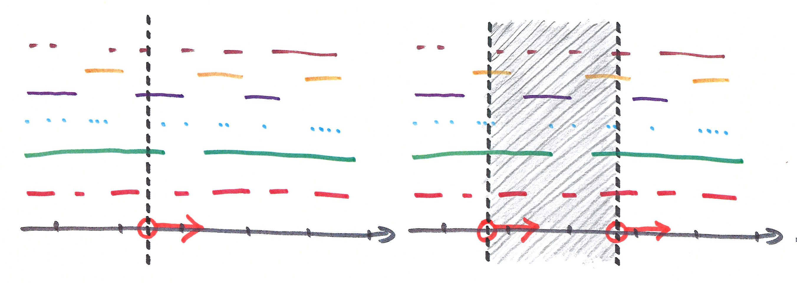
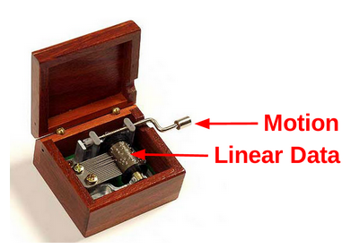

- [Sequencer Background](background_sequencer.html)
- [Sequencer API](api_sequencer.html) 
- [Sequencer Usage](usage_sequencer.html)
- [Sequencer Example (page-local)](exp_sequencer.html)
- [Sequencer Example (multi-device)](online_sequencer.html)
- [WindowSequencer Example (page-local)](exp_windowsequencer.html)
- [WindowSequencer Example (multi-device)](online_windowsequencer.html)


## Abstract

> *Sequencer* is a generic tools for *timed execution* of *timed data*.

*Sequencing* broadly refers to the process of translating a timed script into timed execution. Sequencing is not a new concept. Frameworks for timed media or timed presentation are always built around some form of sequencing logic. However, implementations are typically internal, custom to specific media formats, and tightly integrated with predefined UI components. Furthermore, media clocks and media controls (e.g. play/pause) are also tightly integrated, making it hard to synchronize frameworks with other timed media.

To address these issues, the Sequencer is designed with two main goals.

**1) Isolate sequencing logic from data and UI.**
The Sequencer is pure JavaScript and fully encapsulates sequencing logic, without introducing any dependencies to specific data formats or UI elements. By virtue of being data-agnostic and UI-agnostic, the Sequencer makes common timing logic available for any Web application and any purpose.

**2) Use TimingObject as timing source.**
The [TimingObject](http://webtiming.github.io/timingobject) is a simple concept encapsulating both timing and timing controls. It is proposed as a unifying approach for temporal interoperability in the Web, and prepared for standardization by the [W3C Multi-device Timing Community Group](https://www.w3.org/community/webtiming/). In short, by sharing a single timing object as timing source, independent Sequencers may be precisely coordinated in time. Crucially, this is also true in the distributed scenario, as timing objects support synchronization with online timing objects. So, by using the timing object as timing source, the Sequencer is ready to support precise sequencing in both single-device as well as multi-device scenarios.

## Toc

- [introduction](#introduction)
- [timeddata](#timeddata)
- [sequencing modes](#sequencingmodes)
- [music box analogy](#musicbox)
- [design goals](#designgoals)
- [related work](#relatedwork) 
- [importance](#importance)
- [future work](#futurework)
- [credits](#credits)
- [licence](#licence)


<a name="introduction"></a>

## Introduction

> Sequencers work on timed cues and emit *enter* and *exit* events at the correct time when data becomes *active* or *inactive*, according to some timing source. 

The core idea is that programmers express temporal validity of objects by associating them with intervals or points. (Points are intervals of lenght 0). For instance, a subtitle may be associated with [12.1, 17.44], thus indicating validity in reference to some media timeline. Furthermore, in order to decouple sequencers from a specific data model, intervals are not associated directly with data objects, but indirectly through some unique identifier. For instance, programmers may use identifiers from an application specific data model as keys into the sequencer.

> Sequencers manage a collection of *(key,interval)* associations, where *intervals* define the temporal validity of *keys*. 
> A (key,interval) association is also known as a *cue*.

The Sequencer uses the timing object as timing source. The main function of the Sequencer is to emit *enter* and *exit* events at the correct time, as cues become *active* or *inactive*. The Sequencer also maintains a list of *active cues*, always consistent with history of event callbacks and the state of the timing object.

The Sequencer supports two modes of operation; [default sequencing mode](#sequencingmodes) and [window sequencing mode](#sequencingmodes). These two modes differ in how they define *active* and *inactive* state for cues. 

The Sequencer API is similar to [TrackElements](http://www.html5rocks.com/en/tutorials/track/basics/).

> The Sequencer is *data-independent* and can therefore be used with any application-specific data model, provided only that application data can be associated with unique keys, and that temporal aspects can be expressed in terms of intervals or singular points.


<a name="timeddata"></a>

## Timed Data 

By linear data we simply mean data that is somehow organised according to an axis, e.g., a point on the axis, or an interval. For instance, a subtitle may be structured as follows, where properties *start* and *end* indicate when the object should be active, in reference to the time-axis.

```javascript
var obj = {
	text : "Hello!",
	type : "subtitle",
	start : 24.3,
	end : 28.7
}
```

The figure below illustrates multiple tracks (i.e. different colors) of linear data on the same timeline. 



To avoid dependency on a particular data model, we separate data from timing information, and instead link them together through a unique key. 
This way, sequencers work exclusively on cues, i.e. (key, interval) pairs, and remain agnostic with respect to a particular data format. 
Intervals define when keys are active (in reference to some axis). Emitted enter and exit events include keys which may then be used to fetch the appropriate objects from the data model.

```javascript
var cue = {
	key : "unique key",
	interval : new Interval(24.3,28.7)
};
datamodel["unique key"] = {text: "Hello!", type: "subtitle"};
```

<a name="sequencingmodes"></a>

## Sequencing modes

The **Sequencer** supports two modes of operation; default and window sequencing. These two modes differ in how they define *active* state for cues. This difference is illustrated by the figure below, with default sequencing mode on the left and window sequencing mode on the right. The vertical lines illustrate the moving positions of timing objects. The Sequencer uses one timing object in default sequencing mode, and two in window sequencing mode.



> In default sequencing mode, the Sequencer defines a cue to be *active* whenever the cue interval covers the moving position of the timing object.

In the illustration cues from the green and purple track are currently active. A cue from the brown track has just been exited, and in a short while a blue cue will be entered and then quickly exited. Default sequencing mode is good for timed presentation, where enter and exit events correspond directly to UI modifications.

> In window sequencing mode, the Sequencer defines a cue to be *active* whenever the cue interval is fully or partially covered by the moving interval defined by its two timing objects.

In the illustration 4 brown cues, 2 yellow, 1 purple, 2 green and 3 red cues are active. Window sequencing mode is good for visualizing sliding windows of data, or to implement timed prefetching of data needed for timed presentation. Note the two timing objects can be controlled independently, so the active interval might be controlled to grow and shrink dynamically.

Both modes maintain the invariable that active cues are always consistent with the state of the timing object(s). So, when timing objects skip to a new position on the timeline, cue events will be exited and entered accordingly.


<a name="musicbox"></a>

## Music box analogy

The music box below is another effective analogy for sequencer functionality. As the illustration shows, the music box takes two kinds of input, linear data on the cylinder and motion from the crank. When motion is applied the music box outputs sounds at the correct moments in time, possibly to produce a melody.

Sequencers similarly works on timed data and motion of a timing object, and it outputs enter and exit events at the correct moments in time. Crucially though, Sequencers are superior to the music box in two important aspects:

First, sequencers are designed to support *dynamic* linear data. This implies that the raw material of a linear presentation may be modified at any time during playback, in terms of both media content and timing aspects. This may be done directly by audience viewers interacting with the presentation, or by a production team. Sequencers ensure that this can occur safely by fully encapsulating the complexity that arise from this.

Second. sequencers use timing objects as timingsource and maintains time-consistency for any kind of movement supported by the timing object, be it double speed, backwards, jumping ahead or even acceleration. Furthermore, by virtue of being based on the timing object, sequencers may be remote controlled across the Internet. Thsu, sequencers may also play part in synchronised multi-device presentations, presenting the same timed data at multiple screens, or different (related) data sets in a multi-screen production.

The music box analogy also indicates that sequencing is a common challenge across application domains. Historically, sequencing challenges have been persued independently in musical applications and in multi media. Standardization of sequencer tools might therefore be beneficial for a wide array of applications. 




<a name="designgoals"></a>

## Design goals

General purpose sequencing tools for Web applications are valuable. Sequencing tools allow various kinds of timed data and UI components to be integrated easily and used for timed presentation, without requiring application programmers to re-invent required timing logic. Furthermore, by integrating a general purpose sequencing mechanism with the [timing object](http://webtiming.github.io/timingobject), media products using this mechanims would readily be open for synchronization and external control, both in single-device and multi-device scenarios.

Below we list important design goals for a general purpose sequencing mechanism for the Web.  

- **Data-independency**. The sequencing mechanism should be implemented without reference to any specific data format. This way, timing support for a wide range of data formats can be provided, including application-specific data formats.
 
- **UI-independency**. The sequencing mechanism should not be bundled with any predefined UI elements or UI frameworks. This ensures that programmers are free to exploit it for any purpose, including purposes that require custom UI solutions or no UI at all. General purpose UI components for timed presentation may still be developed and shared independently.

- **Precise timing**. The sequencing mechanism should be based on a precise timeout mechanism (e.g. setTimeout) for enter/exit events to be emitted with high precision, ideally correct down to a single millisecond. This additionally ensures effectiveness with respect to power consumption.

- **Expressive controls**. The sequencing mechanism should support any motion supported by the timing object, including fast forward, slow motion, backwards playback, immediate jumps or acceleration. This way, the sequencing mechanism may support a variety of media control primitives, appropriate for a wide range of media applications.

- **Dynamic data** The sequencing mechanism should allow modifications of timed data to safely occur at any time, with immediate and consistent effects, and without introducing any added complexity for the programmer. This would enable both live authoring and live viewing of dynamic timed media, applicable in both single-device and collaborative, multi-device scenarios.

- **Simple usage**


Sequencers in the timingsrc library honour all these design goals.


<a name="relatedwork"></a>

## Related work

All media frameworks includes some form of timeline, playback controls and sequencing logic.

#### TextTracks
In the Web, text track support is integrated with media elements, allowing for instance subtitles and chapter information to be aligned with video playback. The text tracks are open for any data, but the video UI logic is set up to recognize certain track types such as subtitles of different languages. Similarly, [popcornjs](http://popcornjs.com) is a javascript framework allowing anything web to be synchronized with video playback. While this approach is useful, it also comes with some limitations. The timing model of the video element is push-based and non-deterministic, and the implementation of the sequencing logic seems to be poll-based, making the timing precision of enter/exit events rather coarse. Even worse, the tight integration with the video element does not simplify the construction of media presentations with multiple media elements, or with no media element at all.

#### SMIL
Synchronized Multimedia Integration Language [SMIL](http://www.w3.org/TR/SMIL) is a media framework allowing the integration and playback of various media types. Temporal aspects such as paralellism, sequentialism and repetitions may be expressed through a dedicated declarative language. SMIL addresses temporal interoperability, but only within the confines of the framework. Internally it likely has concepts similar to the timing object and the sequencer. However, these concepts are only available through the use of SMIL's declarative HTML-inspired authoring model. Declarative syntax like this quickly grows complicated and cumbersome to work with. Separation between content and presentation tends to be weak. Furthermore, declarative syntax is not highly flexible and often works best when media content is largely static. In contrast, real-world sources for timed data are often represented in application specific formats, and increasingly dynamic - particularly in live production scenarios.

#### Web Animation
[Web Animations](http://www.w3.org/TR/web-animations) is a framework for animations with progress controls. Concepts of timelines and progress controls are similar to the timing object. The animation framework is concerned with the construction animations from a variety of mathematical functions, how they can be combined and parameterized, and how they can be anchored to the timeline. These animations are then sampled in real time to provide gradual changes in output values. Various sampling rates can be specified for different animations. In contrast, the Sequencer operates based on timeouts instead of repeated evaluation. This means that the Sequencer primarily targets abrupt changes at precisely the correct time, rather than coarser poll-based detection of gradual change. For this reason, the Sequencer is more relevant for discrete phenomena, where timed objects are distributed more sparsely or un-evenly along the timeline. The Sequencer is also more efficient with respect to power consumption. Crucially, the main point is to combine a sequencers with animations. For instance, a sequencer can be used to load and un-load an animation at the correct time, whereas the use of animations can be limited to gradual phenomena, for instance smoothing the abrupt transitions driven by the sequencer. With animations driven by the timing object, animations and sequencers would even be precisely coordinated in time.

#### Web Audio
[Web Audio](http://webaudio.github.io/web-audio-api/) The Web Audio API offers web support for creation and playback of music. The core of this framework has much to do with timing, as the framework allows music to be generated based on scheduling of audio samples. Multi-device timing would enable these tools to be put to work in multi-device scenarios, such as collaborative live music production and multi-device concerts. If so, the Web Audio framework would have to integrate with the timing object. The current scheduling mechanism uses the clock of the audio stack directly, so the natural rate of operation for the framework is fixed. This is problematic for multi-device synchronization. Time shifting must also be handled by application programmers. Integration with timing object and sequencer would simplify integration of the Web Audio framework with other timed components, both in single and multi-device scenarios.


<a name="importance"></a>

## Importance

#### Any kind of timed data, any purpose

The Sequencer function and API is inspired by text tracks supported by HTML media elements. Unfortunately, the close integration between text tracks and media elements may have obscured the full potential of such sequencing mechanisms. It is commonly believed that the utility is limited to media supplementing video. In contrast, by isolating sequencer logic from media elements, specific data formats and UI solutions, the value of the sequencer as a generic programming tool becomes much more evident. 

- Sequencer logic is easily recognised as a part of any media framework. By providing the Sequencers as ready made components, programmers may easily build new frameworks and timed components.
- Sequencers may be used to produce web-based visualisations from any kind of timed data, or to organize the correct execution of any timed operation. Examples of timed resources might include timed images, text, CSS, JSON, HTML, scripts, geolocations, sensor-data, SVG, audio samples, canvas operations etc. In other words, anything Web. 
- Sequencers may be used for timed actions that do not result in output (e.g. visual/audio) at all. For instance, consider timed pre-fetching of data or timed network requests in a test setup. 
- The ability to deliver data at the correct time may also be used to reduce complexity in content transfer. In particular, real-time (multi-cast) streams are often used as a mechanism to preserve time-ordering and timing across a network - even though timing relations may be corrupted by transport delay and jitter. With timestamped messages and a sequencer on the receiving end, all temporal relations may be correctly re-created, independent of the mechanism used for data transfer. This gives more flexibility in the choice of transport mechanism, and reduces complexity at the sender-side.


#### Defining the state of linear media

The sequencer is particularly suited for the construction of linear media. Essientially, the construction of linear media comes down to a few central challenges.

1. how the linear state is represented. The state must be well defined for all positions on the timeline.
2. how the linear state is used to render output (e.g. visuals) at a given position
3. how the linear state is used to modify the rendered output (e.g. visuals) during playback (relative to previous rendering).

Linear state can be represented in more than one way. For example, consider the linear presentation of a chess game. The linear state of this game may be defined either as 1) a sequence of board positions, or 2) as a sequence of piece moves. Which to choose is up to the programmer.

1) If linear state is a sequence of board positions, each board position will be mapped to an interval on the timeline. Enter and exit events from the sequencer will then trigger state transitions in the presentation. 

2) If linear state is a sequence of piece moves, each piece move will be mapped to a singular point on the timeline. Events from the sequencer may then be used to calculate board positions by applying a piece move to the previous position.

Approach 2) is somewhat similar to the classical model for state representation in continuous media, where media content is represented as a sequence of snapshots (I-frames) and virtual snapshots are calculated from diffs (P-frames, B-frames). This model is attractive for any kind of time series where each data point has a large footprint in bytes, but where diffs between data points can be expressed more effectively. By mapping snapshots to intervals and diffs to singular points, Sequencers might be used as playback engine also for such a data model.   


<a name="futurework"></a>

## Future work

Sequencers in the timingsrc library are completed, yet there may still be avenues for further work.

#### New Sequencer types and features

- These Sequencers supports timing based on interval and singular points on the timeline. Though this will likely be of common utility, other ways of mapping objects to a timeline might also be conceivable.  
- Repetition and periodicity is also a common theme in timed data, particularly in the context of music. The Sequencers in timingsrc do not have any particular support for this, though one way to achieve periodicity is to hook Sequencer up with a looping timing object. 

#### Sequencer implementations in other languages.
The value of this timing model and concepts like timing objects and sequencers is not limited to JavaScript and the Web. Implementations of these concepts for other programming languages and environments would ultimately allow temporal interoperability across a variety of platforms. For a programmer, the experience of controlling a multi-device Web presentation from a terminal application, and vice versa, would likely highlight the great value of temporal interoperability.


<a name="credits"></a>

## Credits

Ingar M. Arntzen 

- [ingar.arntzen@motioncorporation.com](mailto://ingar.arntzen@motioncorporation.com)
- [github.com/ingararntzen](https://github.com/ingararntzen)
- [twitter.com/ingararntzen](https://twitter.com/ingararntzen)

The development of the Sequencer is funded in part by the [EU FP7 MediaScape project](http://mediascapeproject.eu), and results are contributed as reference implementation to the W3C Multi-device Timing Community Group.

The Sequencer is joint work with Njål T. Borch

- [njaal.borch@motioncorporation.com](mailto://njaal.borch@motioncorporation.com)
- [github.com/snarkdoof](https://github.com/snarkdoof)
- [twitter.com/njaalborch](https://twitter.com/njaalborch)

<a name="licence"></a>

## License

Copyright 2015 Norut Northern Research Institute.

Author : Ingar Mæhlum Arntzen

The Sequencer is free software: you can redistribute it and/or modify it under the terms of the GNU Lesser General Public License as published by the Free Software Foundation, either version 3 of the License, or (at your option) any later version.

The Sequencer is distributed in the hope that it will be useful, but WITHOUT ANY WARRANTY; without even the implied warranty of MERCHANTABILITY or FITNESS FOR A PARTICULAR PURPOSE.  See the GNU Lesser General Public License for more details.

You should have received a copy of the GNU Lesser General Public License along with the Sequencer.  If not, see [http://www.gnu.org/licenses/](http://www.gnu.org/licenses/).
