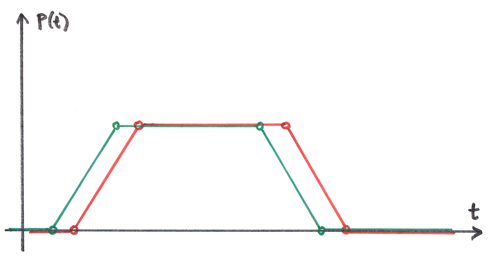
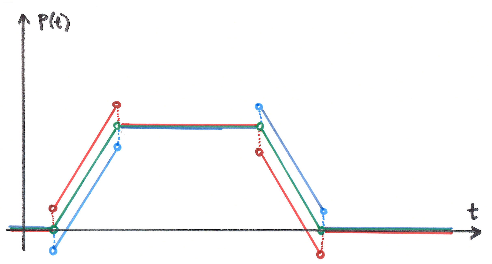
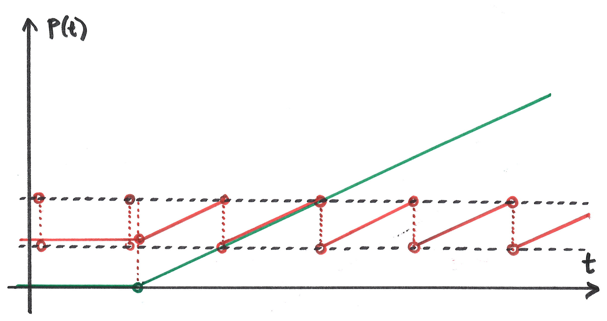

- [Timing Converter Background](background_timingconverter.html)
- [Timing Converter API](api_timingconverter.html)
- [Timing Converter Example (page-local)](online_timingconverter.html)
- [Timing Converter Example (multi-device)](online_timingconverter.html)

Timing Converters are useful when you need an alternative representation for a Timing Object. For instance, 
if different media components refer to different timelines, *skewed* representations of a common timing object could make up for this.
*Scaling* the timing object might also be useful in some circumstances. In video playback the position of a timing object typically represents media offset in seconds. 
Alternatively, frame numbers could be reported as position, with standard playback velocity being 24 or 25 (fps), depending on the media format.
Or, when working with music it might be sensible to use beat number as position, and beats per second (bps) as velocity. 
Again, different representations might be required to integrate different media components, or simply to suit the preferences of different programmers.

A Timing Converter provides an alternative representation for a Timing Object. 

- a timing converter **is** a timing object that depends on another timing object. 
- the *timingsrc* property of a Timing Converter identifies its source timing object.  
- a timing converter implements some modification relative to its *timingsrc*, but never affects the *timingsrc* in any way.
- different timing converters can depend on the same *timingsrc*.
- a timing converter can itself be the *timingsrc* of another timing converter.

So, a hierarchy/chain of timing converters can be created, where all timing converters ultimately depend on a common timing object as root.
Timing converters typically provide a single modification. More complex modifications can be achieved by combining multiple timing converters. 

#### Timing Object

This position-time diagram illustrates the behavior of the timing object. The x-axis is real time, and the y-axis is the position of the timing object, at different moments in time. Each circle denotes an update to the timing object. Initially the position is 0.

- 1) update start the timing object (positive velocity) and the position increases linearly. 
- 2) update pauses the timing object, and position remain unchanged.
- 3) update starts the timing object backwards (negative velocity) and position decreases linearly.
- 4) update pauses the timing object. This update is applied at the exact moment when previous movement hits position zero. 

#### Skew Converter

The effect of the skew converter is illustrated with red coloring. A positive skew is supplied, shifting all positions in the positive direction.

#### Scale Converter

Scaling the by a factor 2 means that all values (position, velocity and acceleration) are multiplied by 2. 

For example, a factor 1000 scales values in seconds to values in milliseconds. Velocity 1s/s becomes velocity 1000ms/s. 

#### Delay Converter

Delay converter re-plays the behaviour of the timing object, with a fixed delay. Update events are delayed too. 

#### Timeshift Converter

Timeshift converter timeshifts the behavior of the timing object. Red color is ahead in time (speculative). Blue color is after in time. When the position is static, time-shifting has no effect. The Timeshift converter does not timeshift update events.  

#### Range Converter

The two dotted black lines illustrate a range restriction for the range converter. The range converter will be equal to the timing object, whenever the timing object is within this range. If the timing object is outside, the timing converter will assume the position closest to the timing object. Range converter generates its own update events.

#### Loop Converter

The two dotted black lines illustrate a range restriction for the loop converter. When the timing object is inside this range, the loop converter will be equal to the timing object. When the timing object is outside, its position is translated to a value within the range, i.e. modulo of range length. 